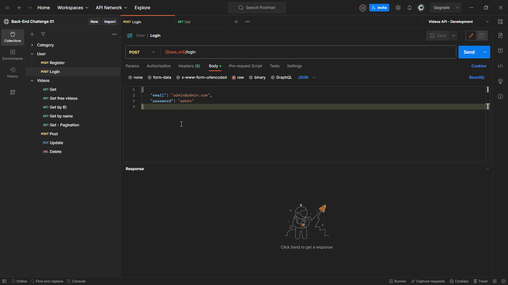

# API to movies 🎞️

This is my project created from Alura's first backend challenge. The challenge is to create an API over four weeks where, each week, we receive tasks and business rules that must be fulfilled for the actual work environment simulation.

## Table of Contents
- [Tools](#Tools)
- [Installation](#installation)
- [Usage](#usage)
- [Configuration](#configuration)
- [Features](#features)
- [Testing](#testing)
- [Contact Information](#contact-information)

## Tools 🛠️

-  🔨 Node.js - Language used. 
-  🔨 Adonis.js - framework to help with all ecosystem and details.   
-  🔨 Prisma - ORM to facilitate communication with database. 
-  🔨 PostgreSQL - Database selected.
-  🔨 Zod - Validation lib.
-  🔨 jsonwebtoken - create token lib.
-  🔨 bcryptjs - crypto lib.
-  🔨 japa runner - test lib.

## Installation

To install and set up this project, follow these steps:

1. Clone the repository.
2. Navigate to the project directory.
3. Run `npm install` to install the dependencies.
4. Configure the environment variables in the `.env` file. 
5. Run `npm start` to start the application.

## Usage

### Run migrations

First, with all set up, you can run the command `npx prisma migrate dev` to run the migrates in your database and furthermore to sow he.

After this run the command `npm run start` to start the server. 

### See endpoints working at the Postman. 

To see the endpoints API at work, I recommend that use Postman. To help with this [click here to see the workspace that I made available already with endpoints, headers, and bodies request set up, you only need to make a fork](https://www.postman.com/navigation-candidate-37863564/workspace/back-end-challenge-01). You only need to make a fork of that workspace.

As for everywhere request we go made will be necessary the session token, I recommend making a login first on endpoint '/login' and catching the token that has a duration of 30 minutes to use in other requests. You can follow these steps: 

Now you can make how many requests you want.

## Configuration

The project requires the following environment variables to be set:

- `PORT`: The port number on which the server should listen for incoming HTTP requests.
- `HOST`: Represents the host address or IP address on which the server should bind itself to listen for incoming requests.
 - `NODE_ENV`: To control various aspects of the application's behavior based on the environment. 
 - `APP_KEY`:  Is typically a random string of characters and should be kept confidential. It is used for various security-related purposes. 
 - `DRIVE_DISK`: Typically represents the name or identifier of the disk or storage driver to be used for file storage and retrieval.
 - `DB_CONNECTION`: Database URL for Prisma ORM. On project was used PostgreSQL but prima also support MySQL, SQLite, SQL Server, MongoDB and CockroachDB. I recommend testing using some PostgreSQL database, if choice another one, some change will be necessary in the `prisma.schema` file. 

Copy the `.env.example` file and rename it to `.env`. Set the appropriate values for the environment variables.

## Features

- Management: Create, retrieve, update, and delete - movies, categories and users.
- Authentication: Secure endpoints with JWT-based authentication.
- Section free: endpoint to see free movies.

## Testing

Before run test make sure the you seeded database. You can seed the database with command `node ace prisma-seeder:run` or run `npx prisma migration reset` that go reset the database, apply migrattion, and seed database.  

To run test you run the command `npm run test` or `yarn test`

## Contact Information

For question, feedbacks or bugs reports you can contact me from [email](caulicons.jobs@gmail.com) or [Instagram](https://www.instagram.com/caulicons_/).
